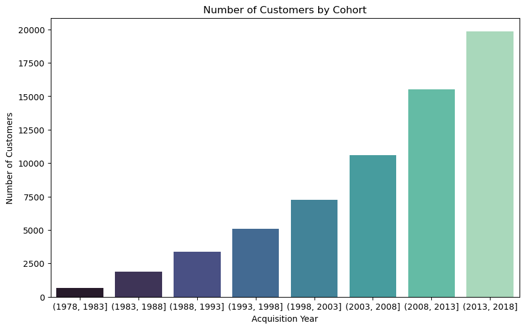
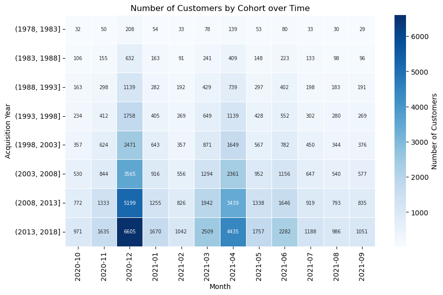
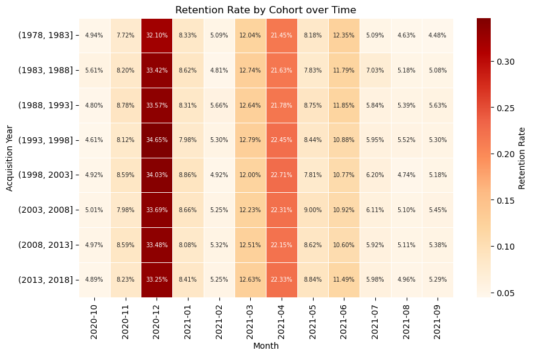
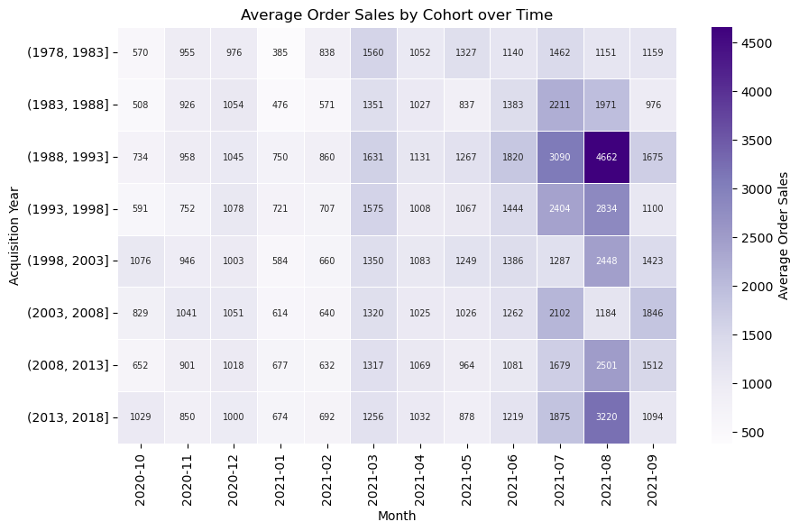
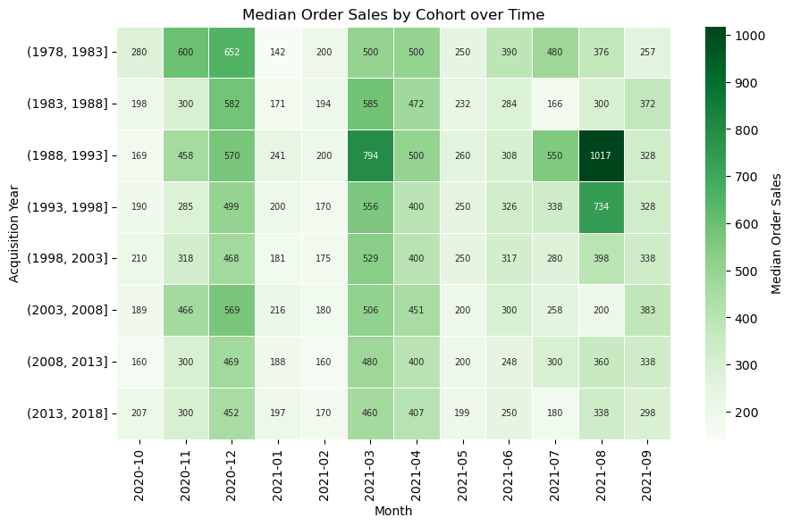

# 1. Introduction
## 1.1. About Cohort Analysis

**Cohort analysis** is an analytical technique that categorizes and divides data into groups (cohorts) with common characteristics prior to analysis. This technique helps us isolate, analyze, and detect patterns in the lifecycle of a user, to optimize customer retention, and to better understand user behavior in a particular cohort.

Businesses use cohort analysis to understand the trends and patterns of customers over time to tailor product and service offers to the identified cohorts.

Three major types of cohort:
- Time-based: groups customers based on the time they started using a company's products or services.
- Segment-based: groups customers by the type of product or level of service they signed up for.
- Size-based: groups customers based on their size.

## 1.2. Business Questions and Dataset

Using Python to carry out time-based cohort analysis that allows stakeholders to asscess and compare retention and order revenue from different cohorts of customer to optimize and tailor products and services offers to these specific cohorts.

The dataset is from Kaggle ([Link](https://www.kaggle.com/datasets/ytgangster/online-sales-in-usa)), consists of 36 columns and 286392 entries, records online sales data of different products, several merchandise and electronic in different states in USA from October 2020 to September 2021.

Overview of the dataset:

Since the goal of this project is to analyze time-based cohorts, let's extract neccessary columns as follows: 

## 1.3. Analysis Approach

This analysis focuses on performing time-based cohort analysis: cusomter will be divided into acquisition cohorts depending on the years that they become customers. Due to the wide spread of customer acquisition years (from 1978 too 2017), I will create 5-year bins as cohorts for this analysis.

The goal of this analysis is to point out the significant trends and patterns in retetion rate and revenue of different customer cohorts based on their acquisition time, then give recommendations to optimize sales and marketing stategies to improve overall performance.

The analysis will follow these steps:
1. Import and clean data
2. Assign cohorts
3. Retention by cohort
4. Revenue by cohort

# 2. Data Visualization
## 2.1. Retention by Cohort
### Number of Customers by Cohort

### Number of Customers by Cohort over Time

### Retention Rate by Cohort over Time

## 2.2. Revenue by Cohort
### Average Order Sales by Cohort over Time

### Median Order Sales by Cohort over Time

# 3. Insights and Recommendations
### Retention
- **Number of Customers**: Company has long lasting customers from 1978. The number of newly accquired customers has been increasing sustainably over the years.
- **Retention Rate**: Though the number of customer in each cohort differs, it is notable that all cohorts roughly share the same trends and patterns in retention rates: highest peak of around 32-34% in Dec 2020 (holiday shopping season - Christmas and New Year) and second peak of 21-22% in Apr 2021 (pre-summer holiday, sales events in Apr such as the annual Amazon Prime Day and the Memorial Day sales). The periods around these holiday seasons, Nov to Jan and Mar to Jun, have relatively higher retention rates than those of other months that are around 5%. This might be due to saving money for the holidays, fewer major sales events, etc.
### Revenue
- **Average Order Sales**: The average order sales patterns are not clear. Mar, Jun and Sep 2021 perform slightly better. Jul and Aug 2021 record significantly high values but only in some cohorts.
- **Median Order Sales**: In general, all cohorts have similar median order sales patterns over the months, with an increase in Dec, Mar, and Apr, and a descrease to the lowest in Jan and Feb.Aparently, the cohorts (1988, 1993], (1978, 1983], (1993, 1998]  witnesses the best performance.

### Recommendations
- In term of both average and median order sales, **several cohorts perform extremely well in Jul and Aug 2021 despite the fact that the number of customers are small**. Those customers could have high income and be willing to spend a lot. The customer behavior of these groups could be investigated to tailor the company's offers. 
- It's necessary to investigate more about other factors such as Customer Acquisition Cost. Instead of spending expensive amount of money to acquire a new customer, it's worth to care old customer better: personalize customer experience, stay in touch, offer loyalty programs, offer incentives, etc.